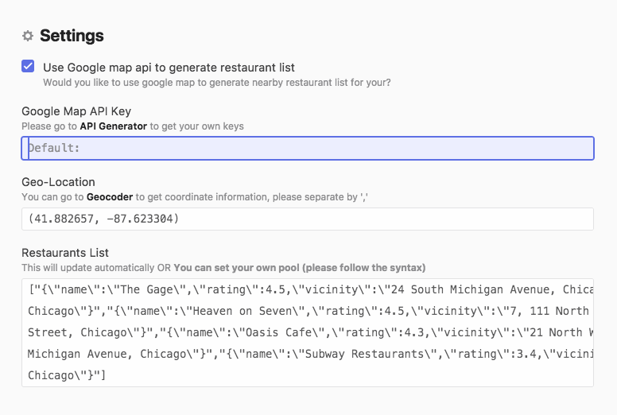
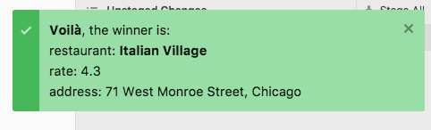

# Random Select Nearby Restaurant for Lunch
Pick nearby restaurant for lunch for you, so that you don't have to be struggled.

## Installing
Clone the repo. Then do a `apm link` to add package to atom.

*OR*

`apm install where-to-lunch`

*OR*

go to the atom package settings and find `where-to-lunch`

## Settings
Go to package manage view to edit configurations.
You can either
- Use google map api to get nearby restaurants list
- Have your own restaurant lists.

If using google map api, please follow the steps below:
1. Generate your own API key, please go to [Google place API](https://developers.google.com/places/web-service/get-api-key) and follow instructions.
2. Input addresses. You can also have settings about **keyword, radius, max price, opennow**

## Usage
To pick a restaurant, use `ctrl-alt-p` or go from `Packages -> where-to-lunch -> Pick Restaurant`

If not satisfied, pick it again!

## Next step
- allow random function based on reviews of the restaurants
